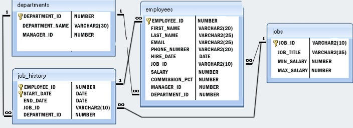

# Uma plataforma de emprego, conforme requisitos abaixo:

- Deve haver crud para todas das tabelas
- Não necessita de autenticação
- Não será avaliado visual ou usabilidade, mas poderá ser um diferencial.
- Os códigos desenvolvidos devem estar disponíveis em repositórios no Github com repositório público.
- A plataforma/serviço deve estar disponível no Heroku, assim como o banco de dados.

## Modelo de dados:

( )

## Requisitos não funcionais:

### Tecnologia:

- Frontend - Angular >= 6
- Backend API - PHP e Laravel
- Database - PostgreSQL
- Hospedagem / Build:
- Plataforma deve estar funcionando no heroku: backend, frontend e database
- Versionamento:
- - Repositório separados (Github) para backend e frontend

Rodando a api:
docker-compose exec api composer install
docker-compose exec api php artisan key:generate
